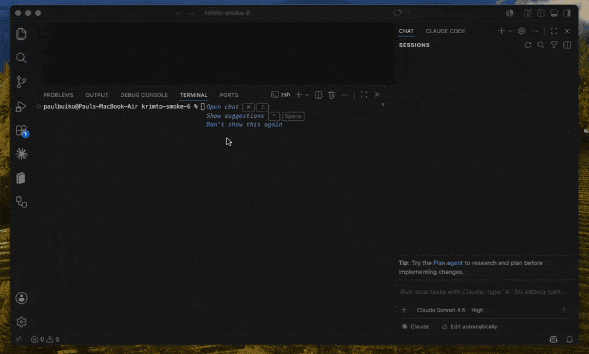

# Krimto

> Open-source memory for AI coding agents you own in git — governed by a real user→team→org hierarchy, not a vendor database. Solo to team. Apache-2.0.

[](LICENSE)
[](https://www.npmjs.com/package/@krimto-labs/krimto)
[](https://github.com/krimto-labs/krimto/actions/workflows/test.yml)

Your agent's memory, as markdown in your own git — synced across every editor and machine. Tell your
agent "remember X" in any editor and it saves a durable, attributable fact; ask later — in a new chat,
a different editor, or on another machine — and it recalls the right answer. One command, no account,
no vendor database: your memory follows you.

You own it: every fact is a plain markdown file in a git repo you control — readable, reviewable in a
PR, and yours. When a teammate joins, that same memory becomes a shared team brain governed by a real
`user → team → org` hierarchy (the most specific scope wins at recall) — the one primitive no other
memory tool ships. Solo is free; the governance is what you grow into.

## See it

One `npx` command sets it up; then your agent saves a fact in Claude Code and recalls it in Cursor —
no account, no database:

<!-- media/krimto-demo.gif is the lead demo (docs/ is gitignored, so the README can't link there).
     The full three-demo storyboard lives at docs/demos/krimto-demos.html (local). -->


Three short demos — **solo** (remember in Claude Code, recall in Cursor), **cross-machine** (write,
`git push`, recall on another laptop), and **team** (a teammate's fact reaches you; your personal notes
stay yours).

Because every memory is just a file in your git, you can read it yourself — no API, no dashboard needed:

```console
$ cat ~/.krimto/user/you@example.com/favorite-color.md
---
id: fct_01KT3BDSYY1KK80SG3S7KBEV58
scope: user/you@example.com
title: Favorite color
author: you@example.com
created: 2026-06-02T05:03:14Z
updated: 2026-06-02T05:03:14Z
tags:
  - personal
source: claude-code
---

User's favorite color is red.

$ git -C ~/.krimto log --oneline -1
8bc5b86 krimto: write batch — 1 fact
```

That's the whole bet: **your agent's memory is plain markdown in a git repo you own — not rows in
someone else's database.**

## Why Krimto

- **You own it, in your git.** Every fact is a markdown file in a git repo you control — `git log` the
  audit trail, edit it in any editor, review it in a pull request. No vendor database, no lock-in.
- **Governed `user → team → org` hierarchy.** Knowledge is scoped to a person, a team, or the whole
  company, and the most specific scope wins at recall — a server-enforced primitive no other memory
  tool ships for free.
- **Follows you everywhere — cross-vendor, Apache-2.0.** One MCP server syncs the same memory across
  Claude Code, Cursor, Codex, Gemini CLI and more — every editor and machine. Fully open source, with
  no managed-service restriction.

## Try it in 2 minutes (solo, no account)

```bash
npx @krimto-labs/krimto init
```

The setup wizard detects your editor, wires it up, and turns on automatic memory. Then, in any chat:

```
"Remember that our staging DB resets every Sunday."
```

Open a new chat and ask:

```
"What do you know about staging?"   → it remembers.
```

See your notes with `krimto notes` (terminal) or `krimto ui` (browser dashboard). Your data lives in
`~/.krimto` — the same folder no matter which project you're working in.

## Connect your agent

`krimto init` wires supported editors for you. What auto-connects vs. needs one copy-paste step:

| Editor | Setup |
|---|---|
| Cursor | auto-connects |
| Claude Code | auto-connects |
| Codex | manual snippet |
| Gemini CLI | manual snippet |

To connect any MCP client manually, point it at Krimto over stdio:

```bash
claude mcp add krimto -- npx -y @krimto-labs/krimto
```

…or the config-file form (Cursor, Codex, Gemini CLI, etc. use the same shape):

```json
{ "mcpServers": { "krimto": { "command": "npx", "args": ["-y", "@krimto-labs/krimto"] } } }
```

By default an agent uses Krimto only when you ask. Running `krimto init` once in your project drops a
standing rule so it uses Krimto on its own.

### Install as a Claude Code plugin

Prefer Claude Code's plugin system? Add Krimto's marketplace and install it directly:

```bash
/plugin marketplace add krimto-labs/krimto
/plugin install krimto@krimto
```

This bundles the MCP server together with Krimto's skills, the `/krimto-status` command, and the
memory hooks — no separate `krimto init` needed.

## How it works

Three layers, one source of truth:

1. **Storage** — facts are markdown files in a git repository (the source of truth; git is the audit log).
2. **Index** — a SQLite + sqlite-vec hybrid index (keyword + vector) for fast retrieval, with scope
   precedence applied at ranking time.
3. **Access** — an API server enforces who can read and write each scope (`user` / `team` / `org`).

## Team mode

When you're ready to share memory with teammates:

```bash
npx @krimto-labs/krimto team init
```

This walks you through an admin email, your org/team name, an optional shared git remote, and
teammate invites — then prints a join command for each teammate:

```bash
krimto join --server <url> --key <key>
```

Teammates can connect to one shared server, or each run their own Krimto synced over a shared git
remote. Personal and team notes live together and sync as a unit. Step back to solo any time with
`krimto team disband` (your notes are preserved).

## Self-host

Krimto runs anywhere Node 20+ runs.

```bash
# HTTP server + browser dashboard at http://localhost:8080
npx @krimto-labs/krimto serve

# or Docker
docker run -d -p 8080:8080 -v ~/.krimto:/data ghcr.io/krimto-labs/krimto:latest
```

Run `npx @krimto-labs/krimto --help` for the full command surface.

## Roadmap

v0.2 (current) ships the memory core, teams, the web dashboard, and the cross-vendor MCP server.
Next: OAuth sign-in and a pull-request approval flow (v0.3), then a hosted Krimto Cloud (v1.0). See
[ROADMAP.md](ROADMAP.md).

## Contributing & license

Contributions welcome — see [CONTRIBUTING.md](CONTRIBUTING.md) and our
[Code of Conduct](CODE_OF_CONDUCT.md). Security reports: [SECURITY.md](SECURITY.md).

Licensed under [Apache-2.0](LICENSE). The same code is self-hostable by a solo developer or an
enterprise — no tier walls.
